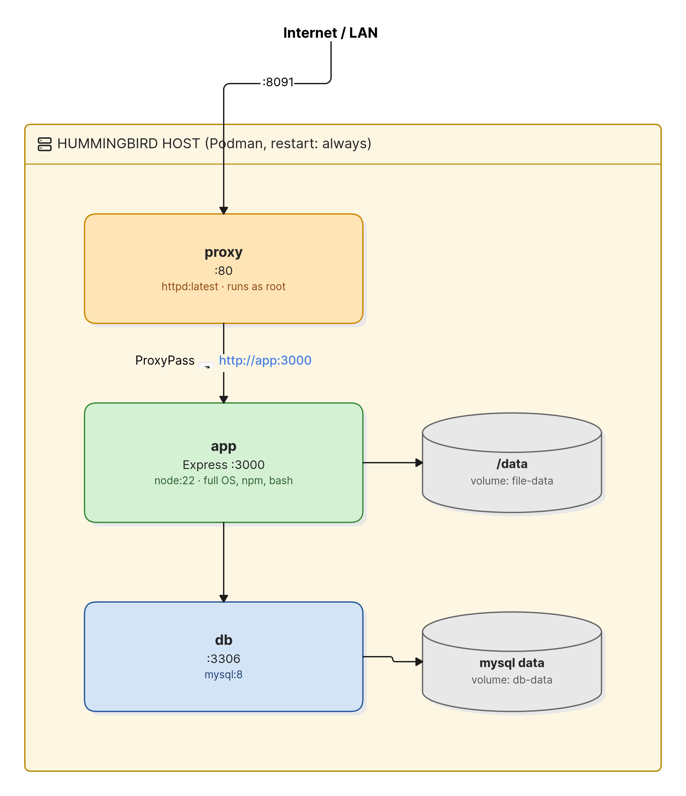

# Architecture: File Drop on Standard Container Images

## Context

File Drop is a file-upload service: upload a file through a web page, get a download link back. This version runs on standard Docker Hub container images inside a Fedora Hummingbird Linux VM, the same host OS as [filedrop-hummingbird-hardened](https://github.com/Brillar0101/filedrop-hummingbird-hardened).

Both projects deploy on the same Hummingbird OS. The difference is entirely in the container images. This project answers two questions:

- What is the impact of using external container repositories? When your stack requires software outside the Hummingbird `hi/*` catalog, you pull from Docker Hub and inherit the full CVE exposure of standard images.
- How does Fedora Hummingbird Linux still protect you? Even with unhardened containers, the host OS provides protections that a traditional Fedora server does not.

On Hummingbird, `dnf install` is blocked because the host root filesystem is read-only. Workloads run as containers instead. But when the required software has no Hummingbird `hi/*` image, you pull from external repositories like Docker Hub, and the CVE exposure inside those containers is similar to what you would have on a traditional server.

## Components

| Component | Image | Job |
|-----------|-------|-----|
| App | Built on `docker.io/library/node:22` | Express.js + web UI, file upload/download |
| Web / Proxy | `docker.io/library/httpd:latest` | Reverse proxy, upload size limits |
| Database | `docker.io/library/mysql:8` | Stores file metadata (name, size, ID) |
| File storage | Podman volume at `/data` | Stores uploaded file bytes |
| DB storage | Podman volume at `/var/lib/mysql` | MySQL data directory |

## Deployment Topology



The same Hummingbird OS as the hardened project, with two ways to deploy:

- **VM:** boot a Hummingbird VM (same disk image as the hardened project), deploy with plain podman
- **Container:** `podman-compose up -d` on any Linux host (for local testing)

Only the httpd proxy is exposed (port 8091). The app and database are internal.

## Build Pipeline

This project uses a single-stage build. One `FROM`, install dependencies, ship everything. The final image includes npm, bash, apt-get, curl, build tools, and the full Debian userland.

```
Dockerfile (one stage):
  FROM node:22           <-- full image, ~1 GB, Debian-based
  COPY app/ .
  RUN npm install        <-- npm stays in final image
  CMD ["node", "server.js"]
```

The hardened project uses a multi-stage build where the final image is distroless. This project deliberately uses a single-stage build because that is the standard approach when you don't have a distroless base image to target.

## Security Model

What the containers lack compared to the hardened project:

| Property | This project (unhardened) | Hardened project |
|----------|--------------------------|------------------|
| Runtime user | root | 65532 (non-root) |
| Shell access | Yes (bash, sh) | No (distroless) |
| Package manager | Yes (npm, apt) | No |
| Security headers | None | X-Content-Type-Options, X-Frame-Options, Referrer-Policy |
| Root filesystem | Read-write | Read-only, immutable |
| Image size | ~1 GB+ | ~100-200 MB |

### What Hummingbird Linux still provides

Even when containers carry hundreds of CVEs, the Hummingbird host OS provides protections that a traditional Fedora server does not:

- **Immutable host root filesystem.** The host OS root is read-only. An attacker who escapes a container still cannot modify the host OS, install rootkits, or create persistence.
- **Atomic OS updates via bootc.** The host updates as a whole image. An update either fully applies or does not apply at all. No half-patched state, no drift between machines.
- **Instant rollback.** `bootc rollback` reverts to the previous known-good OS image in a single command.
- **No host-level package manager.** You cannot `dnf install` on a running Hummingbird host. The host is image-based; what ships in the image is what runs. An attacker who escapes a container cannot install tools on the host.

Hummingbird does not eliminate the risk of running unhardened containers (the CVEs inside the containers are real), but it contains the damage to the container layer in ways a traditional mutable server cannot.

## Key Decisions

**MySQL, not PostgreSQL.** There is no `hi/mysql` image in the Hummingbird catalog, which is exactly the point. MySQL forces this project onto standard Docker Hub images.

**Node.js/Express, not Python/FastAPI.** There is no `hi/node` image in the Hummingbird catalog. Using a completely different language and framework from the hardened project makes the comparison more realistic.

**Apache httpd, not nginx.** There is no `hi/httpd` image in the Hummingbird catalog. Apache is a common choice for reverse proxying, and its absence from the catalog reinforces the point.

**Single-stage build, runs as root.** This is the standard approach. Most Dockerfiles on Docker Hub look like this. It produces a high CVE count because everything (npm, bash, apt, curl, gcc) ships in the final image.
