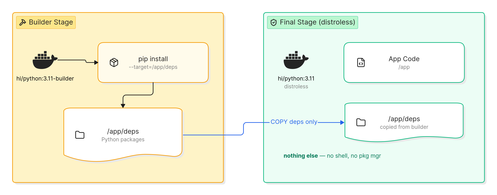

# Hardened vs Unhardened Container Images on Fedora Hummingbird Linux

This document answers three questions using two deployments of the same application — a file-upload service called File Drop — both running on Fedora Hummingbird Linux:

1. **How is the near-zero CVE goal implemented?**
2. **What is the impact of using external container repositories?**
3. **How does Fedora Hummingbird Linux protect you regardless?**

---

## The two deployments

Both projects deploy on a **Fedora Hummingbird Linux VM** — the same host OS, built from the same disk image. The only difference is the container images running inside.

| Component | filedrop-hummingbird | filedrop-unhardened |
|-----------|---------------------|---------------------|
| **Host OS** | Fedora Hummingbird VM | Fedora Hummingbird VM |
| App runtime | Python 3.11 (FastAPI) | Node.js 22 (Express) |
| App image | `hi/python:3.11` (distroless) | `node:22` (full Debian) |
| Proxy | `hi/nginx:latest` | `httpd:latest` |
| Database | `hi/postgresql:17` | `mysql:8` |
| Image source | `registry.access.redhat.com/hi/` | `docker.io/library/` |

---

## How Fedora Hummingbird Linux differs from traditional Fedora

Before comparing the two deployments, it helps to understand how Hummingbird changes the deployment model.

On a **traditional Fedora server**, you set up your stack by installing packages directly on the host:

```bash
# Traditional Fedora — install on the host
sudo dnf install nginx postgresql-server python3-pip nodejs mysql-server httpd
pip install fastapi uvicorn
npm install express
sudo systemctl enable --now nginx postgresql mysqld httpd
```

You can install anything, modify any file, and the system accumulates packages and drift over time. Every package — and every dependency it pulls in — is a potential CVE source, and it all lives on the host.

On **Fedora Hummingbird Linux**, this model is replaced:

```bash
# Hummingbird — these commands do NOT work
sudo dnf install nginx               # blocked: root filesystem is read-only
pip install fastapi                   # blocked: no pip on the host
sudo vi /etc/some-config             # blocked: root filesystem is immutable

# Instead, everything runs as container images
podman pull registry.access.redhat.com/hi/nginx:latest     # Hummingbird image
podman pull docker.io/library/httpd:latest                  # or Docker Hub image

# The host OS itself updates as a whole image
sudo bootc upgrade                    # pull the next OS image (atomic)
sudo bootc rollback                   # revert if it breaks
```

The host OS is read-only and image-based. You do not install packages on it. You run your workload as containers. The question then becomes: **which container images do you use?** That is what the two deployments below compare.

---

## 1. How is the near-zero CVE goal implemented?

The `filedrop-hummingbird` project demonstrates the mechanism. It is not a single trick — it is a set of disciplines enforced by the Hummingbird image ecosystem and the build process.

### Distroless images

Hummingbird `hi/*` images are distroless: they contain only the language runtime and the libraries it needs. There is no shell (`bash`, `sh`), no package manager (`pip`, `apt`, `npm`), no system utilities (`curl`, `wget`, `gcc`). Every package in a container image is a potential source of CVEs. Fewer packages means fewer CVEs.

### Multi-stage builds

A framework like FastAPI needs `pip` and build tools to install dependencies. The multi-stage build (`Containerfile`) solves this: a builder stage (`hi/python:3.11-builder`) installs dependencies, then the final image (`hi/python:3.11`) copies only the installed packages. The final image ships without `pip` or any build tooling.



### Non-root user

Every container runs as UID 65532 (a non-root user set in the Containerfile). A compromised process has no root privileges inside the container.

### Read-only root filesystem

The container root filesystem is immutable at runtime. An attacker who gets code execution inside a container cannot modify the filesystem — no writing binaries, no editing configs, no creating persistence.

### No tools for an attacker

Even if an attacker gains code execution inside a Hummingbird container, there is nothing to work with: no shell to run commands, no package manager to install tools, no `curl` or `wget` to download payloads. The attack surface is as small as the image.

### Verification by scanning

The near-zero CVE claim is not taken on faith — it is verified by scanning every image with a tool like `grype`:

```bash
grype filedrop_app:latest
```

Run the scan and see the actual count. The number depends on the images and their patch level at the time you scan.

---

## 2. What is the impact of using external container repositories?

Not every technology has a Hummingbird `hi/*` image. There is no `hi/node`, no `hi/httpd`, no `hi/mysql`. When your application stack requires software outside the Hummingbird catalog, you pull from external repositories like Docker Hub — and you inherit everything those images carry.

The `filedrop-unhardened` project demonstrates this. It is the same app (file upload service with the same functionality), deployed on the same Hummingbird OS, but using standard Docker Hub images.

### What ships in a standard image

A standard base image like `node:22` is built on Debian and includes hundreds of pre-installed packages that the application never uses:

- **Shell:** `bash`, `sh` — ready for an attacker to run commands
- **Package managers:** `npm`, `apt-get` — ready to install additional tools
- **Network tools:** `curl`, `wget` — ready to download payloads or exfiltrate data
- **Build tools:** `gcc`, `make` — ready to compile exploits
- **System libraries:** OpenSSL, zlib, and dozens more — each one a potential CVE source

Every one of these is unused by the File Drop application but ships in the final container image.

### Single-stage build, runs as root

Standard Dockerfiles are typically single-stage: one `FROM`, install dependencies, ship everything. The final image includes the package manager (`npm`), the build tools, and the full OS userland. The container runs as `root` by default.

```
Single stage (node:22, full Debian)  →  npm install + app code + entire OS
```

### The CVE impact

The CVE difference comes from the base images, not the application code. Both apps have similar dependency counts and similar functionality. But a full Debian-based image carries hundreds of packages that each can have vulnerabilities, while a distroless Hummingbird image carries only the runtime.

Scan both and compare:

```bash
# Hummingbird (distroless)
grype filedrop_app:latest           # from filedrop-hummingbird

# Standard (full OS)
grype filedrop_app:latest           # from filedrop-unhardened
```

### What an attacker gets after compromise

| Scenario | Hummingbird container | Standard container |
|----------|----------------------|-------------------|
| Shell access | None (no bash, no sh) | Full (bash, sh) |
| Install tools | Impossible (no package manager) | `apt-get install` anything |
| Download payloads | No `curl`, no `wget` | Both available |
| Modify filesystem | Read-only root | Read-write, unrestricted |
| Privilege level | Non-root (UID 65532) | Root |

### Security headers

The hardened project's nginx config sets `X-Content-Type-Options`, `X-Frame-Options`, and `Referrer-Policy`. The unhardened project's httpd config omits them. This is a configuration choice, not inherent to the images, but it reflects the difference in security posture between the two approaches.

---

## 3. How does Fedora Hummingbird Linux protect you?

Both projects run on the same Fedora Hummingbird Linux host. Even when containers are pulled from external repositories and carry hundreds of CVEs, the host OS provides protections that a traditional Linux server does not.

### Immutable host root filesystem

The Hummingbird host OS root filesystem is read-only. If an attacker escapes a container, they still cannot:

- Modify system binaries on the host
- Install a rootkit or backdoor on the host OS
- Edit host configuration files
- Create persistence mechanisms on the host filesystem

The OS itself is sealed. Writable state is confined to specific areas (`/var`, `/etc`), and the core system is untouchable.

### Atomic OS updates via bootc

The host OS is managed as a versioned image, not as a set of files. Updates are applied atomically through `bootc`:

```bash
sudo bootc status      # what image is currently running
sudo bootc upgrade     # pull and stage the next OS image (atomic)
```

An update either fully applies or does not apply at all. There is no half-patched state, no partial update that leaves the system inconsistent. Every host running the same image is identical — no configuration drift between machines.

### Instant rollback

If an OS update causes problems, `bootc rollback` instantly reverts to the previous known-good image:

```bash
sudo bootc rollback    # revert to the previous OS image
```

This is critical for always-on services. You can keep the host patched without risking extended downtime from a bad update.

### No host-level package manager

On a Hummingbird host, you cannot run `dnf install` to add software to the OS. The host is image-based — what ships in the image is what runs. This means:

- An attacker who escapes a container cannot install tools on the host
- No accidental package installs that widen the attack surface
- No configuration drift from ad-hoc package additions

If you need additional software on the host, you build it into a new host image and deploy that image. The same discipline that keeps containers clean applies to the OS itself.

### Image-based OS management

The host OS is a single, versioned, reproducible artifact. Build it once, deploy it to one machine or a hundred — every machine is byte-for-byte identical. This property holds regardless of what container images run inside. Combined with `bootc upgrade` and `bootc rollback`, it gives you a fleet of hosts that are always patched, always identical, and always recoverable.

### What this means for the unhardened deployment

The `filedrop-unhardened` project runs containers with hundreds of CVEs inside them. A vulnerability in one of those containers could allow an attacker to gain code execution inside the container. But the Hummingbird host limits the blast radius:

- The host OS cannot be modified (immutable root)
- Other containers on the same host are isolated
- The host itself stays patched and recoverable (bootc update/rollback)
- There are no tools on the host to pivot with (no package manager)

Hummingbird Linux does not eliminate the risk of running unhardened containers — the CVEs are real, and a container-level compromise is a container-level compromise. But it contains the damage in ways a traditional mutable Linux server cannot.

---

## Running the comparison

### Scan the Hummingbird app

```bash
cd ~/projects/filedrop-hummingbird
podman-compose up -d
grype localhost/filedrop-hummingbird_app:latest
```

### Scan the unhardened app

```bash
cd ~/projects/filedrop-unhardened
podman-compose up -d
grype localhost/filedrop-unhardened_app:latest
```

### Scan the base images directly

```bash
# Hummingbird images
grype registry.access.redhat.com/hi/python:3.11
grype registry.access.redhat.com/hi/nginx:latest
grype registry.access.redhat.com/hi/postgresql:17

# Standard Docker Hub images
grype docker.io/library/node:22
grype docker.io/library/httpd:latest
grype docker.io/library/mysql:8
```

Run these scans yourself to see the actual numbers. The difference is in the base images, not the application code.
