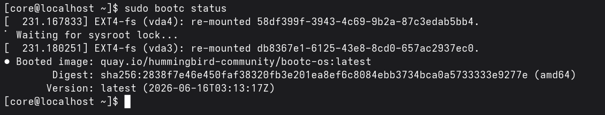
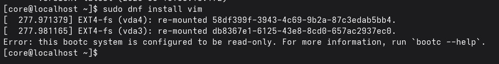
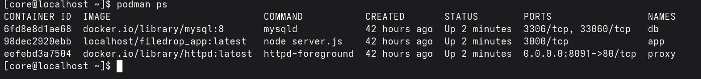
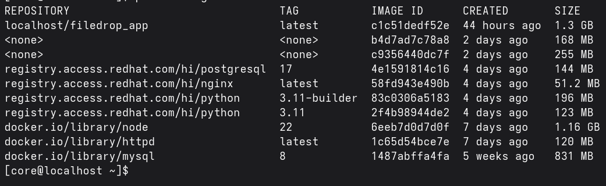
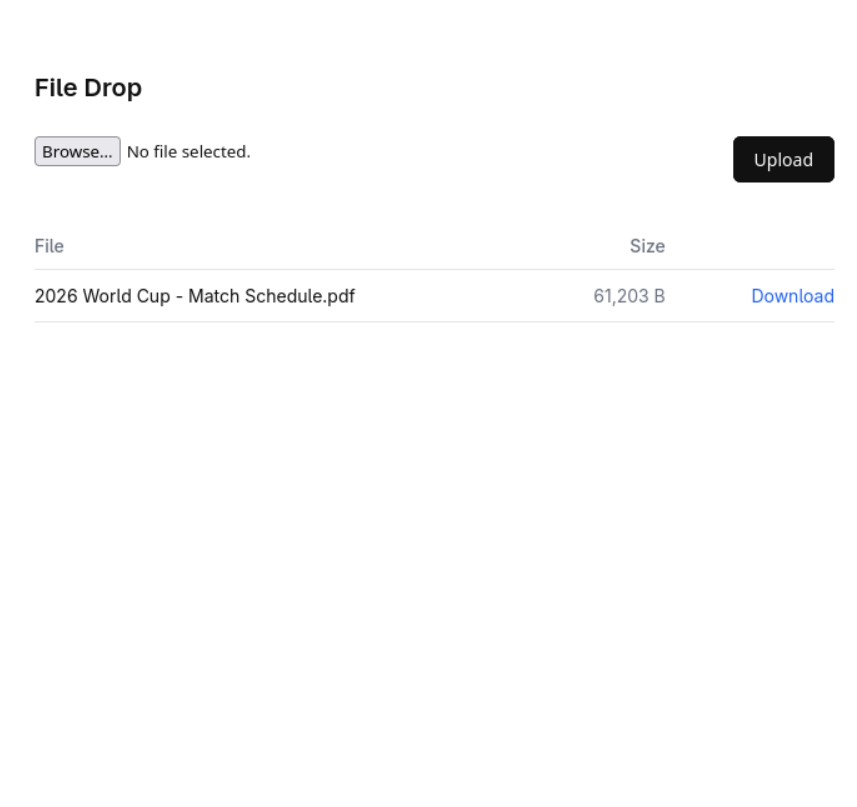
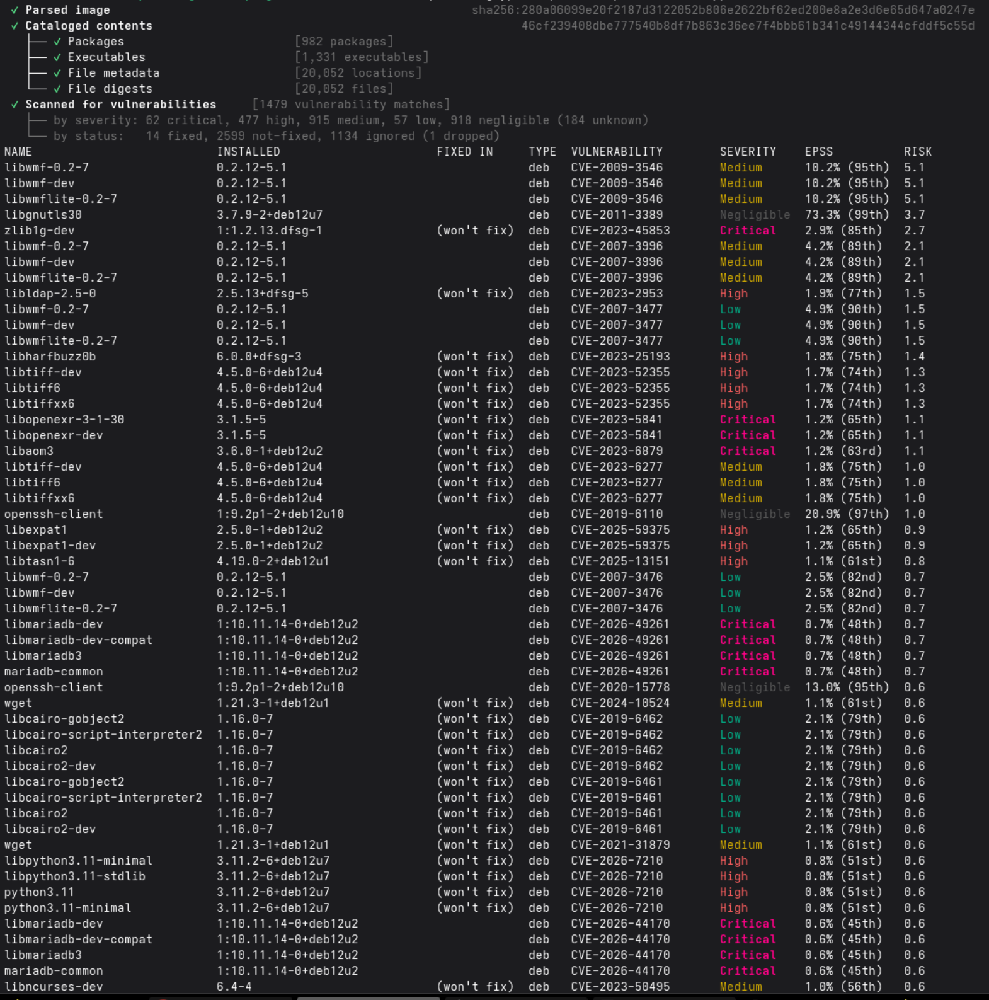

# File Drop on Standard Container Images

File Drop is the same file-upload service as [filedrop-hummingbird-hardened](https://github.com/Brillar0101/filedrop-hummingbird-hardened). Upload a file through a web page, get a download link back. But the container images are different: this version uses standard Docker Hub images because Node.js, Apache httpd, and MySQL have no Hummingbird `hi/*` equivalent.

Both versions deploy on the same Fedora Hummingbird Linux VM. Same OS, same functionality, dramatically different container-level security.

## The same Hummingbird OS

Even though the containers are unhardened, the host OS is identical. `bootc status` confirms the VM is running the Hummingbird OS image:



And `dnf install` is still blocked. The host root filesystem is read-only regardless of what containers run inside:



## The running stack

After deploying, three containers run on standard Docker Hub images. Notice `docker.io/library/` in every image name:



The image sizes tell the story. The app image alone is 1.3 GB because it includes the full Debian userland. Compare that to the Hummingbird `hi/*` images at 51-196 MB:



## The UI

The File Drop UI works the same as the hardened version. Upload a file, get a download link:



## CVE scan results

A grype scan of the unhardened app image shows 1,470 vulnerability matches including 62 critical. The hardened version shows a handful:



The vulnerabilities come from the base image, not the application code. Standard Docker Hub images ship hundreds of packages the app never uses, but each one can have CVEs.

```bash
grype filedrop-hummingbird-unhardened_app:latest
```

## What this means

When your stack requires software outside the Hummingbird `hi/*` catalog, you pull from external repositories and inherit their full CVE exposure. The Hummingbird host OS still protects you (immutable root, atomic updates, no host package manager), but the containers themselves carry the risk.

See [filedrop-hummingbird-hardened](https://github.com/Brillar0101/filedrop-hummingbird-hardened) for the hardened version, and [`COMPARISON.md`](./COMPARISON.md) for the full side-by-side analysis.
